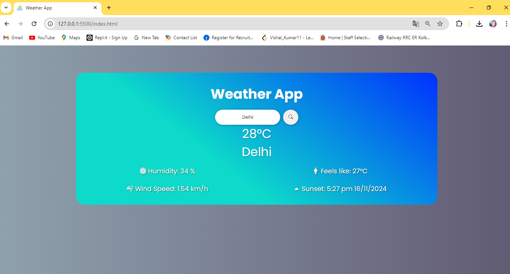
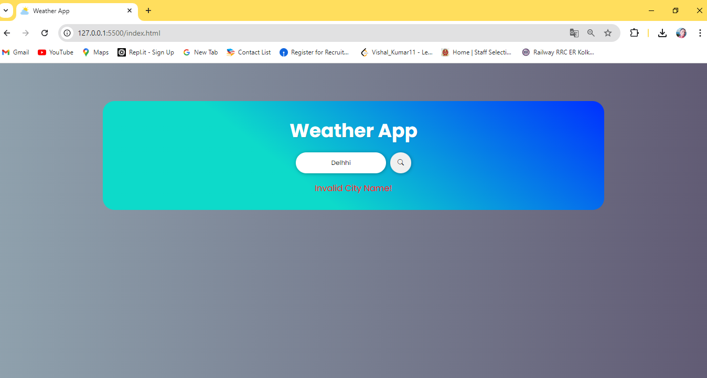

# 🌦️ Weather App

Welcome to the Weather App! This web application provides users with real-time weather information by simply entering the name of a city. It fetches data from the OpenWeather API to display current temperature, humidity, wind speed, "feels like" temperature, and sunset time. Designed with a user-friendly interface, the app enhances the experience of checking weather updates effortlessly.

## 🌐 Demo

Check out the live demo here 👉: [Weather App Demo](https://12vishalkumar.github.io/weatherApp_Aganitha)

## 🔑 Key Features

- **City Search**: Enter a city name to receive instant weather details using the OpenWeather API.
- **Real-Time Weather Details**: Displays temperature, humidity, wind speed, and "feels like" temperature.
- **Dynamic Weather Icon**: Icons change according to the current weather conditions (e.g., sunny, cloudy, rainy).
- **Sunset Time**: Provides the exact sunset time for the searched city in a user-friendly format.
- **Error Handling**: Notifies the user if an invalid city name is entered.

- **Temperature Display:**

  - Instantly view the current temperature of any city.

- **Additional Key Features:**

  - **Humidity:**

    - Display the current humidity level 

  - **Wind Speed:**

    - Provide information on the current wind speed 

  - **Feels Like:**

    - Indicate the perceived temperature, often accounting for factors like humidity and wind 

  - **Sunset Time:**
    - Show the time of sunset with the date 

- **Basic API Details:**
  - Access essential API details to understand the source of weather information.

## 🛠️ Technologies Used

This project incorporates modern web technologies for a smooth and efficient user experience:

- **HTML5**: Structures the layout, including search bar and weather information display.
- **CSS**: Styles the app with a responsive and visually appealing layout.
- **JavaScript**: Handles API integration, dynamic data updates, and user interactions.

## 🎯 Purpose & Motivation

The Weather App was developed to offer a simple and effective solution for accessing current weather information with ease. The integration with OpenWeather API ensures users receive accurate and up-to-date data, enhancing convenience and usability. Designed with a clean interface, this app serves as a handy tool for anyone wanting quick weather updates on the go.

## 🧑‍💻 Usage Guide

- **Enter a City**: Type a city name in the search bar and click the search button.
- **View Weather Details**: Instantly view temperature, humidity, wind speed, "feels like" temperature, and sunset time.
- **Error Notification**: If an invalid city name is entered, an error message "Invalid City Name!" appears.

## 🎨 Customization

This app is easy to customize. You can:

- **Update Styles**: Modify `style.css` to adjust colors, layout, or fonts.
- **Extend Functionality**: Add features like sunrise time, additional weather metrics, or multi-day forecasts by enhancing the JavaScript file.
- **Use Alternative Icons**: Replace weather icons with any other icon set or add more weather conditions to display.

## 📸 View of My Project: Weather App

- **Weather Display**
  

- **Error Notification**
  

## 📜 License

This project is licensed under the MIT License - see the [LICENSE](LICENSE) file for details.

## 🙏 Acknowledgements

Special thanks to:

- [OpenWeather API](https://openweathermap.org/) for providing weather data.
- [Google Fonts](https://fonts.google.com/) for the beautiful "Poppins" font.
- [Bootstrap Icons](https://icons.getbootstrap.com/) for the icons used to indicate different weather conditions.
